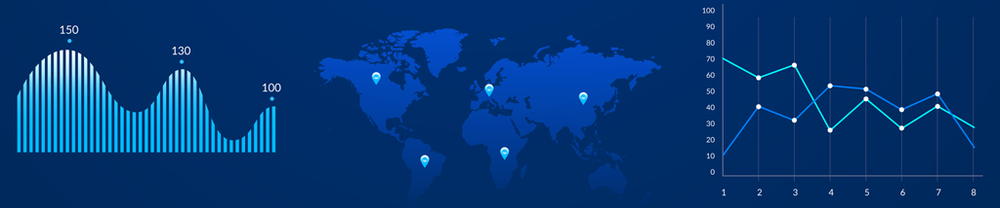

   

  

## Meu Projeto Muito Top

Uma breve descrição do meu projeto, que eu fiz com muito cuidado e atenção aos detalhes, chamando as pessoas para que entrem no meu notebook.

[Link para o projeto completo](https://medium.com/@rafaelnduarte)

**Links para me acharem:**
* [Artigo meu desse projeto no Medium](https://medium.com/@carloshaar)
* [LinkedIn](https://www.linkedin.com/in/carloshaar/)

## Outros Projetos Meus:
Em construção
